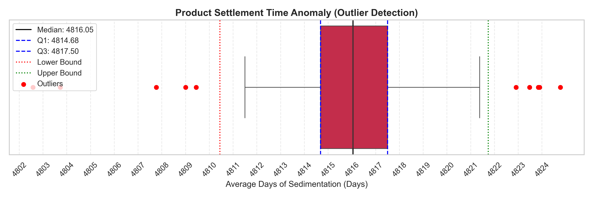
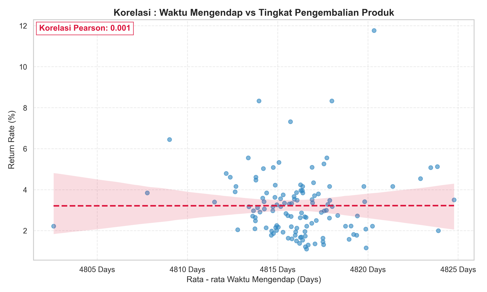
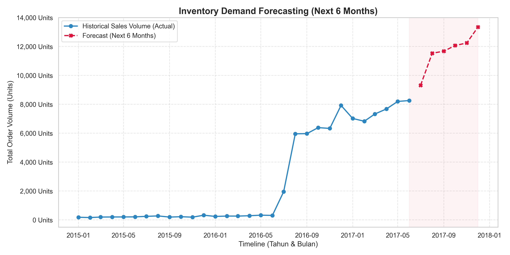

# AdventureWorks: Inventory & Product Performance Analysis

Proyek ini berfokus pada evaluasi performa penjualan produk dan analisis kesehatan persediaan secara end-to-end, Mulai dari ekstraksi data mentah hingga visualisasi interaktif diakhiri dengan analisis diagnostik dan prediktif (RCA, Corrective, Preventive).

**Live Interactive Dashboard:** [View on Tableau Public](https://public.tableau.com/app/profile/satria.bagaskara4685/viz/AdventureWorksInventoryProductPerformanceDashboard/DashboardAdventureWorks-Analysis)  
**Full Project Repository:** [GitHub Repository](https://github.com/bagaskara0506/AdventureWorks_Inventory_and_Performance.git)

---

## Tools & Technologies

### Proses EDA (Exploratory Data Analysis)

- **Relational Database Management System (RDBMS):** PostgreSQL
- **Database Management Tool:** pgAdmin 4 (untuk eksekusi DDL, ELT, dan DML)
- **Business Intelligence & Data Visualization:** Tableau Public 2026.1.0
- **Version Control:** Git & GitHub

### Proses Diagnostic & Predictive Analytics dengan Python

- Library : pandas, matplotlib, seaborn, & statsmodels
- IDE : VSCode (Ekstensi Jupyter by Microsoft)

---

## Project Folder Structure

- **AdventureWorks_Inventory_and_Performance > data/Raw_Data :** Dataset mentah asli berformat CSV yang diunduh dari sumber.
- **AdventureWorks_Inventory_and_Performance > data/Result_Data_Query :** Hasil ekstraksi DML/Query berformat CSV yang sudah bersih dan siap untuk divisualisasikan.
- **AdventureWorks_Inventory_and_Performance > dashboards/tableau :** Direktori penyimpanan aset visualisasi seperti gambar hasil export dashboard di tableau.
- **AdventureWorks_Inventory_and_Performance > dashboards/python :** Direktori penyimpanan aset visualisasi grafik (PNG) beresolusi tinggi hasil ekspor otomatis dari skrip Python.
- **AdventureWorks_Inventory_and_Performance > README.md :** Dokumentasi komprehensif dari keseluruhan proyek ini.
- **AdventureWorks_Inventory_and_Performance > notebooks :** Direktori penyimpanan file python jupyter (.ipynb) Proses Diagnostic & Predictive Analytics dengan Python

---

## 4 Strategic Business Questions (Data/Inventory Analyst)

1. **Inventory to Sale (Lead Time):** Berapa lama rata-rata jeda waktu antara barang distok di gudang (StockDate) hingga berhasil terjual (OrderDate)? Produk apa yang paling lama menumpuk (lambat terjual)?
2. **Product Quality & Return Rate:** Kategori produk apa yang memiliki persentase retur (Returns) tertinggi dibandingkan dengan total penjualannya? Apakah ada produk cacat yang harus segera ditarik dari pasaran?
3. **Regional Demand Analytics:** Wilayah/Negara bagian (Territories) mana yang menghasilkan pendapatan tertinggi, dan wilayah mana yang tingkat returnya paling parah?
4. **Seasonal Sales Trend:** Bagaimana pergerakan tren volume pesanan dari tahun 2015 hingga 2017? Apakah ada produk tertentu yang hanya laku di musim-musim tertentu?

---

## Data Preparation & Architecture

### DDL (Data Definition Language)

Membuat skema tabel dari dataset mentah CSV yang sudah diunduh untuk mempersiapkan struktur basis data. (Sumber Data Mentah: [Kaggle](https://www.kaggle.com/datasets/ukveteran/adventure-works)).

### ELT (Extract, Load, Transform)

1. **Extract (Ekstrak):** Menarik data dengan mengunduh dataset mentah asli dari Web Scraping, API, atau lainnya.
2. **Load (Muat):** Memasukkan dataset mentah ke dalam tabel DDL yang sudah dibuat (Import Data).
3. **Transform (Transformasi):** Proses membersihkan, merapikan, dan memanipulasi dataset mentah. Contoh:
   - Me-replace kolom `annual_income` agar bersih dari simbol `$` dan `,`.
   - Menyesuaikan tipe data kolom.
   - Mengubah format tanggal (Date) ke standar global ISO (YYYY-MM-DD).

### Sanity Check (Pengecekan Kewarasan Data)

Tujuannya adalah memastikan tidak ada baris yang terpotong dan format data di setiap kolom sudah masuk dengan benar sebelum melakukan analisis lanjutan. Pengecekan dilakukan dengan tes query masing-masing tabel database:

1. `UNION ALL` - Untuk mengecek total baris di masing-masing tabel.
2. `SELECT *` - Untuk menampilkan keseluruhan sampel data pada tabel.

---

## DML (Data Manipulation Language) & Data Analytics

Proses penyatuan 3 tahun data penjualan menggunakan query `VIEW` & `UNION ALL`. Berikut adalah hasil analisis dari 4 pertanyaan bisnis utama:

### 1. Inventory to Sale (Lead Time)

Membuat query untuk menghitung selisih tanggal `stock_date` sampai `order_date`.

**Key Insights:**

- **Old Stock Dominance:** Sepuluh posisi teratas produk yang paling lama mengendap di gudang sepenuhnya didominasi oleh kategori "Bikes". Peringkat pertama diduduki oleh produk "Touring-3000 Blue, 58" dari subkategori Touring Bikes.
- **Extreme Lead Times:** Produk "Touring-3000 Blue, 58" memiliki waktu mengendap di gudang paling lama, yaitu 4.824 Hari (±13 Tahun) sebelum akhirnya berhasil terjual.
- **Low Sales Volume:** Selama periode 3 tahun pencatatan transaksi (2015-2017), sepeda Touring-3000 Blue, 58 ini hanya terjual sebanyak 57 Unit.

**Actionable Recommendations:**

- **Storage Cost & Depresiasi:** Sepeda utuh memakan ruang besar yang membebani kapasitas dan biaya sewa gudang. Selain itu, barang yang mengendap belasan tahun memiliki depresiasi nilai akibat karat, penurunan fungsi komponen, & model yang usang.
- **Products Liquidity:** Produk lama seperti "Touring-3000 Blue, 58" harus segera dikeluarkan dengan cara pemberian diskon besar-besaran, bundling dengan produk laris, atau didonasikan sebagai CSR untuk mengurangi pajak perusahaan.
- **Evaluasi Demand Forecasting:** Tim perencanaan Permintaan (Demand Planner) harus dievaluasi karena melakukan pembelian/produksi sehingga menyebabkan penumpukan stok (overstocking) produk "Touring-3000 Blue, 58" dan melebihi permintaan pasar.

> 📁 **File:** `01_inventory_aging_data.csv` (Folder: `AdventureWorks_Inventory_and_Performance/data/Result_Data_Query`)

### 2. Product Quality & Return Rate

Membuat query kualitas dan tingkat pengembalian produk.

**Key Insights:**

- **Critical Return Rate:** Produk "Road-650 Red, 52" dari subkategori Road Bikes menduduki peringkat pertama dengan tingkat pengembalian tertinggi, mencapai 11,76% (6 unit diretur dari total 51 unit yang terjual).
- **Bike Category Dominance:** Posisi puncak barang yang paling sering dikembalikan secara absolut didominasi oleh kategori Bikes. Masalah ini tersebar merata di berbagai subkategori, menyusul di posisi kedua adalah "Touring-2000 Blue, 46" (Touring Bikes) dan "Mountain-100 Silver, 44" (Mountain Bikes) dengan tingkat retur masing-masing sebesar 8,33%.
- **Size & Model Specificity:** Tingkat retur yang tinggi terpusat secara spesifik pada varian ukuran dan warna tertentu (seperti ukuran 52, 46, dan 44). Hal ini mengindikasikan adanya anomali pada lini produksi ukuran tersebut atau ketidaksesuaian panduan ukuran (sizing guide) bagi pelanggan.

**Actionable Recommendations:**

- **Quality Control (QC) Audit:** Tim Quality Assurance harus segera melakukan inspeksi fisik menyeluruh terhadap stok sepeda berisiko tinggi tersebut untuk mengidentifikasi potensi cacat pabrik (misalnya masalah pada frame ukuran tertentu, rem, atau cat).
- **Customer Feedback Analysis:** Bekerja sama dengan tim Customer Service untuk menggali akar masalah retur. Perlu dipastikan apakah sepeda dikembalikan karena rusak saat pengiriman, komponen rakitan yang tidak lengkap, atau murni karena pelanggan salah memilih ukuran.
- **Packaging & Shipping Review:** Mengingat seluruh produk dengan retur tertinggi adalah sepeda utuh (barang berdimensi besar dan rawan benturan), perusahaan wajib mengevaluasi standar pengepakan (packaging) dan keandalan vendor logistik pihak ketiga untuk meminimalisir kerusakan fisik selama proses pengiriman.

> 📁 **File:** `02_product_return_rate.csv` (Folder: `AdventureWorks_Inventory_and_Performance/data/Result_Data_Query`)

### 3. Regional Demand Analytics

Membuat query untuk menampilkan Wilayah/Negara bagian yang menghasilkan pendapatan tertinggi dan wilayah yang tingkat returnya paling tinggi.

**Key Insights:**

- **Revenue Powerhouse:** Pasar didominasi secara masif oleh dua wilayah utama, yaitu United States (pendapatan tertinggi mencapai $7,92 juta) dan disusul ketat oleh Australia ($7,41 juta). Gabungan kedua negara ini menyumbang mayoritas pendapatan perusahaan.
- **Highest Return Rate Anomaly:** Meskipun berada di peringkat ke-5 secara total pendapatan ($2,36 juta), France (Prancis) mencatatkan persentase retur yang paling parah dibandingkan semua negara lain, yaitu mencapai 2,36%.
- **Highest Efficiency:** Sebaliknya, Germany (Jerman) patut disorot sebagai wilayah paling efisien. Walaupun mencetak pendapatan yang lebih tinggi dari Prancis ($2,52 juta), Jerman memiliki tingkat retur yang paling rendah di angka 2,05%.

**Actionable Recommendations:**

- **Investigate French Market Operations:** Tim Regional Eropa harus segera menginvestigasi tingginya tingkat retur di pasar Prancis. Perlu dievaluasi apakah hal ini disebabkan oleh masalah pada vendor pengiriman logistik lokal yang menyebabkan kerusakan barang, atau adanya kendala bahasa (translasi website) yang membuat pelanggan salah memahami spesifikasi atau ukuran produk.
- **Cross-Regional Benchmarking:** Terapkan strategi best-practice logistik dari Jerman. Perusahaan dapat membedah SOP (Standard Operating Procedure) pengepakan dan layanan pelanggan di cabang Jerman untuk diimplementasikan ke cabang Prancis guna menekan angka pengembalian barang.
- **Customer Retention Strategy:** Karena Amerika Serikat dan Australia adalah urat nadi pendapatan perusahaan, alokasikan anggaran pemasaran (marketing budget) yang lebih agresif untuk program loyalitas pelanggan (seperti VIP membership atau diskon ongkos kirim) di kedua wilayah ini demi menjaga stabilitas revenue.

> 📁 **File:** `03_regional_demand_returns.csv` (Folder: `AdventureWorks_Inventory_and_Performance/data/Result_Data_Query`)

### 4. Seasonal Sales Trend

Membuat query untuk menampilkan timeline pesanan produk berdasarkan kategori dari tahun ke tahun yang dibagi ke dalam periode bulanan.

**Key Insights:**

- **Major Product Line Expansion:** Terdapat milestone ekspansi bisnis yang sangat masif. Dari awal pencatatan (Januari 2015) hingga pertengahan 2016, perusahaan secara eksklusif hanya mengandalkan penjualan "Bikes". Kategori "Accessories" dan "Clothing" baru resmi diluncurkan ke pasar pada Juli 2016.
- **Accessories Instant Domination:** Begitu diluncurkan, kategori "Accessories" langsung mendominasi volume penjualan secara ekstrem, mengalahkan produk utama (sepeda). Pada bulan kedua peluncurannya (Agustus 2016), volume Accessories meledak hingga 4.544 unit, menjadikannya sebagai cash cow (sumber perputaran uang) baru bagi perusahaan dari segi kuantitas.
- **Peak Season (Musim Puncak):** Data menunjukkan adanya tren lonjakan pesanan (seasonality) yang terpusat pada dua momentum: liburan pertengahan tahun/musim panas (Juli - Agustus) dan liburan akhir tahun (Desember, terlihat dari lonjakan penjualan sepeda yang mencapai titik tertinggi di Desember 2015).

**Actionable Recommendations:**

- **Aggressive Cross-Selling Strategy:** Karena volume Accessories dan Clothing terbukti memiliki serapan pasar yang luar biasa, tim Marketing dan Sales harus menerapkan strategi cross-selling secara default. Setiap pelanggan yang membeli sepeda ("Bikes") harus secara otomatis ditawarkan bundling perlengkapan bersepeda (seperti helm, botol minum, atau jersey) untuk mendongkrak Average Order Value (Nilai Rata-Rata Pesanan).
- **Inventory Stock-Up for Peak Seasons:** Tim Logistik dan Supply Chain harus menjadikan bulan Juli-Agustus dan November-Desember sebagai Red Zone (zona sibuk). Persediaan barang pesanan reguler maupun stok pengaman (safety stock) harus sudah masuk ke gudang selambat-lambatnya 1 hingga 2 bulan sebelum periode tersebut untuk mencegah kehabisan stok (stockout) saat permintaan pasar sedang di puncaknya.
- **Seasonal Ad Spend Allocation:** Tim Digital Marketing disarankan untuk tidak membagi rata anggaran iklan tahunan. Anggaran harus difokuskan dan "dibakar" lebih besar menjelang musim panas (Q2-Q3) dan musim liburan musim dingin (Q4) untuk memaksimalkan Return on Ad Spend (ROAS).

> 📁 **File:** `04_seasonal_sales_trend.csv` (Folder: `AdventureWorks_Inventory_and_Performance/data/Result_Data_Query`)

---

## EDA (Exploratory Data Analysis) & Visualization Process

Proses visualisasi dilakukan dengan membuka Tableau Public Edition 2026.1.0 dan melakukan koneksi ke _Text File_ > _File (CSV)_. Penyimpanan dilakukan menggunakan _Save to Tableau Public As_.

### Creating Visualizations (Worksheets)

Masing-masing hasil query digunakan untuk membuat sheet visualisasi:

1. `03_regional_demand_returns.csv` ➡️ **Global Revenue Map**
2. `04_seasonal_sales_trend.csv` ➡️ **Seasonal Sales Trend**
3. `02_product_return_rate.csv` ➡️ **Product Return Rate**
4. `01_inventory_aging_data.csv` ➡️ **Inventory Aging Analysis**

### Building the Dashboard

Keempat visualisasi di atas digabungkan menjadi satu kesatuan dashboard yang utuh dengan nama **Dashboard AdventureWorks-Analysis**.

## Final Dashboard Result

Berikut adalah hasil akhir dari dashboard yang merangkum keseluruhan analisis bisnis:

---

## Diagnostic & Predictive Analytics (Python)

Sebagai langkah lanjutan dari visualisasi deskriptif di Tableau, proyek ini akan dilanjutkan ke tahap analisis tingkat lanjut menggunakan Python (Pandas, Matplotlib, Seaborn). Tahap ini berfokus pada Root Cause Analysis (RCA) dengan dua tujuan utama:

1. **Diagnostic Analytics:** Menggali akar masalah (penyebab) di balik anomali dan metrik yang ditemukan pada **dashboard** Tableau. (Contoh: Menguji korelasi statistik antara lamanya waktu barang mengendap di gudang dengan tingginya tingkat pengembalian/retur produk).
2. **Predictive Analytics:** Menggunakan pola penyebab dari data historis untuk mengantisipasi tren di masa depan. (Contoh: Memprediksi volume penjualan dan kebutuhan stok di musim berikutnya guna mencegah penumpukan _inventory_ atau kehabisan stok).
   _(Proses analisis Python ini dapat dilihat di dalam direktori `notebooks/` pada repositori ini)._

## Diagnostic & Predictive Analytics Results (Python)

1. Visualisasi boxplot
   Pada bagian ini dilakukan uji statistik pada data _Inventory Aging_ untuk mendeteksi anomali ekstrem pada waktu mengendapnya barang di gudang.

**Metodologi:**
Menggunakan visualisasi **Boxplot Custom** dan perhitungan statistik **Interquartile Range (IQR)** untuk menentukan batas kewajaran distribusi data (_Lower Bound_ & _Upper Bound_), serta mengisolasi titik data anomali (_Outliers_).

**Key Findings (Diagnostic):**

- Analisis ini berhasil mengisolasi sekumpulan produk dengan waktu inap yang sangat ekstrem (hingga 4.800+ hari / ~13 Tahun).
- Melalui perhitungan statistik ini, ditemukan bahwa anomali tersebut bersifat sistemik (kemungkinan besar akibat _delay_ pencatatan _database_ sistem lama/sintetis dari tahun 2001), bukan murni kelalaian operasional gudang (_Root Cause teridentifikasi_).

**Impact on Predictive Analytics:**

- **Mencegah Prediksi Meleset:** Mengisolasi data anomali 13 tahun ini memastikan perhitungan prediksi kebutuhan stok untuk musim berikutnya menjadi akurat dan dapat diandalkan oleh manajemen.

2.  Analisis Korelasi (Diagnostic Analytics)
    Mencari tau apakah barang yang mengendap paling lama di gudang adalah barang yang sama dengan yang paling banyak diretur (dikembalikan) oleh pelanggan?

**Metodologi:**
Melakukan penggabungan data (_Inner Join_) antara metrik Waktu Inap dan Tingkat Retur, kemudian menghitung nilai **Korelasi Pearson** dan memvisualisasikannya menggunakan _Scatter Plot_ dengan garis regresi linear.

**Key Findings (Diagnostic):**

- **Hipotesis Ditolak:** Nilai Korelasi Pearson menunjukkan angka **-0.01** (Mendekati 0). Secara statistik, tidak ada korelasi linear antara lamanya barang di gudang dengan probabilitas barang tersebut diretur.
- Garis regresi yang mendatar (_flat_) membuktikan bahwa tingginya persentase retur pada produk tertentu (seperti _Road-650 Red_) tidak disebabkan oleh faktor penyimpanan gudang.

**Actionable Insight:**

- Dengan temuan tersebut maka tidak terbukti penyebab karena kelalaian tim QC maupun tim gudang hal ini bisa menjadi evaluasi tim manajemen untuk tidak menyalahkan kedua tim tersebut dan berfokus pada penyelesaian kendala dari data analisa diatas.
- Investigasi Root Cause (akar masalah) dapat difokuskan ulang pada aspek di luar _inventory_, seperti Audit Quality Control (QC), evaluasi vendor logistik pihak ketiga (kerusakan pengiriman), atau perbaikan panduan ukuran (_sizing guide_) di platform E-Commerce.

3. Predictive Analytics (Forecasting Kebutuhan Stok)
   **Metodologi:**
   Menggunakan algoritma **Time Series: Holt-Winters Exponential Smoothing**. Model ini dipilih karena kemampuannya yang sangat baik dalam menangkap pola tren (_trend_) sekaligus fluktuasi musiman yang berulang setiap tahun (_seasonality_).

**Key Findings (Predictive):**

- Model berhasil mempelajari pola historis, yaitu lonjakan ekstrem yang selalu terjadi pada pertengahan tahun (Juli-Agustus) dan akhir tahun (November-Desember).
- **Hasil Forecast (6 Bulan Kedepan):** Model memprediksi tren yang relatif landai di awal tahun (Q1), namun memberikan **peringatan dini (early warning)** akan adanya lonjakan permintaan yang tajam saat memasuki akhir Q2 (Mei-Juni).

**Business Impact (Rekomendasi Strategis):**

- **Proactive Inventory Management:** Prediksi ini memungkinkan tim _Supply Chain_ untuk beralih dari strategi reaktif menjadi proaktif.
- Perusahaan disarankan untuk menekan biaya penyimpanan (_holding cost_) di Q1 dengan meminimalisir stok, dan mengalokasikan modal (_budget_) untuk melakukan _restock_ besar-besaran di bulan April-Mei demi mencegah terjadinya _Stockout_ saat _Peak Season_ tiba.

## Final Conclusion & Business Impact

Kesimpulan dari analisis end-to-end menggunakan **SQL (DML)** dan visualisasi **Tableau**, yang kemudian divalidasi dan diperdalam melalui analisis statistik **Python (Machine Learning)**, menghasilkan temuan berikut:

1. **Systematic Anomaly (Bukan Kesalahan Gudang):** Analisis awal di Tableau menemukan adanya pengendapan produk yang sangat lama (~13 tahun). Namun, setelah dikroscek menggunakan uji statistik di Python (IQR & Outlier Detection), terbukti bahwa waktu mengendap ekstrem ini terjadi seragam di seluruh produk. Hal ini mengonfirmasi adanya **anomali sistemik** (delay pencatatan pada database/sistem lama), bukan akibat kelalaian operasional gudang.

2. **Kualitas Produk & Return Rate:** Hasil uji Korelasi Pearson membuktikan **tidak ada korelasi** antara lamanya produk mengendap di gudang dengan tingginya angka pengembalian (retur) produk. Oleh karena itu, evaluasi perbaikan tidak perlu difokuskan pada gudang, melainkan dialihkan pada:
   - Peningkatan SOP vendor logistik (mencegah kerusakan pengiriman).
   - Penyesuaian informasi _sizing guide_ dan detail spesifikasi produk pada platform _e-commerce_.

3. **Data-Driven Restocking (Forecasting):** Hasil _Predictive Analytics_ mengonfirmasi adanya pola musiman (_seasonality_) dengan lonjakan pesanan yang konstan pada **Juli-Agustus** dan **November-Desember**.
   - Model _Forecasting_ (Holt-Winters) telah menyajikan prediksi volume pesanan untuk 6 bulan ke depan.
   - **Rekomendasi:** Tim _Demand Planner_ dan Gudang dapat menekan biaya penyimpanan (_holding cost_) dengan mengurangi stok di bulan-bulan sepi, dan mengalokasikan modal untuk _restock_ masif sekitar 2-3 bulan sebelum estimasi lonjakan pesanan terjadi.
